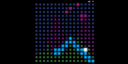

# moonrit

16 x 16 LED matrix games.

## Demo

[XRD](https://abagames.github.io/moonrit/xrd/)

[JEX](https://abagames.github.io/moonrit/jex/)

## Acknowledgement

### Library

[soundfont-player](https://github.com/danigb/soundfont-player) /
[tonal](https://github.com/danigb/tonal)

### Sound font

[Fluid-Soundfont](https://github.com/gleitz/midi-js-soundfonts)
